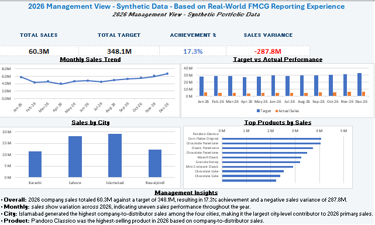

# FMCG Sales Performance & Target Tracking System

## Excel 2019 Portfolio Project

An end-to-end FMCG sales performance, target tracking, distributor analysis, forecasting, and management reporting system built in Microsoft Excel 2019.

## Project Overview

This portfolio project demonstrates how an FMCG sales reporting workflow can be transformed from structured transactional data into management-ready performance analysis.

The workbook covers:

- Sales performance analysis
- Target vs. actual tracking
- Salesperson and RSM performance
- City-level performance
- Distributor analysis
- Product performance
- Distributor stock analysis
- Collection and outstanding analysis
- Sales forecasting
- Management dashboard reporting

## Business Scope

**Sales scope:** Company-to-distributor primary sales (sell-in)

**Secondary sales:** Not available in this model

**Inventory scope:** Distributor stock / inventory snapshots

**Reporting period:** January–December 2026

**Forecast horizon:** January–March 2027

## Workbook Structure

| Sheet | Purpose |
|---|---|
| 01_README | Project overview, scope, and usage notes |
| 02_Control_Panel | Model controls, assumptions, and statistics |
| 03_Cities | City and territory master data |
| 04_Sales_Team | RSM and salesperson hierarchy |
| 05_Distributors | Distributor master data |
| 06_Products | Product and category master data |
| 07_Calendar | Date, month, quarter, and week reference |
| 08_Sales_Targets | Monthly salesperson targets |
| 09_Sales_Transactions | Company-to-distributor sales transactions |
| 10_Inventory | Distributor inventory snapshots |
| 11_Collections | Distributor invoice, payment, and collection records |
| 12_Performance_Calculations | Monthly salesperson performance calculations |
| 13_Target_vs_Actual | Target, actual, variance, and achievement analysis |
| 14_Distributor_Analysis | Distributor sales, stock, and collection analysis |
| 15_Product_Analysis | Product sales, quantity, stock, and ranking analysis |
| 16_Sales_Forecast | Historical sales trends and 3-month forecast |
| 17_Management_Dashboard | Management-level KPI dashboard |
| 18_Model_Documentation | Model methodology, formulas, and documentation |

## Key KPIs

The model calculates and analyzes:

- Total Sales
- Total Target
- Sales Variance
- Target Achievement %
- Monthly Sales Trend
- Salesperson Performance
- City Performance
- Distributor Sales
- Product Contribution
- Distributor Stock
- Outstanding Amount
- Collection Status
- Potential Slow-Moving Stock Indicator
- 3-Month Rolling Sales Forecast

## Target Planning Methodology

The synthetic target framework follows a top-down planning concept:

**Company Target → City Allocation → Salesperson Allocation → Monthly Seasonality**

Illustrative city allocation assumptions:

- Karachi: 35%
- Lahore: 30%
- Islamabad: 20%
- Rawalpindi: 15%

Within each city, salesperson targets are conceptually allocated using a 40% / 35% / 25% planning assumption.

Monthly targets incorporate illustrative seasonality multipliers.

These assumptions are synthetic and are not derived from confidential historical company data.

## Forecasting Method

The forecast uses a **3-month rolling average** based on historical company-to-distributor sales.

The model produces indicative forecasts for:

- January 2027
- February 2027
- March 2027

The forecast is intended as a planning estimate rather than a statistically optimized forecasting model.

## Excel Techniques Used

The project is designed for **Microsoft Excel 2019** and uses techniques including:

- Excel Tables
- SUMIFS
- COUNTIFS
- SUMPRODUCT
- IF / IFERROR
- INDEX + MATCH
- RANK
- AVERAGE
- EDATE
- Pivot-style analysis
- Conditional Formatting
- Data Validation
- Management dashboards
- Formula-driven controls

The workbook avoids Excel 365-only dynamic-array functions.

## Dashboard Preview

## Data Disclaimer

> **Portfolio Disclaimer:** This project is based on real-world FMCG sales reporting and analytical responsibilities previously performed by the author. All company names, distributor names, products, transactions, targets, inventory records, collection records, and financial figures in this workbook are synthetic and illustrative. The project does not reproduce or disclose confidential employer data.

## Repository Contents

- `FMCG_Sales_Performance_Target_Tracking.xlsx` — Complete Excel 2019 portfolio workbook
- `Screenshots/management-dashboard.png` — Management dashboard preview

## Purpose

The objective of this project is to demonstrate practical Data Analyst / Business Analyst capabilities in:

**Data Structuring → KPI Calculation → Performance Analysis → Forecasting → Dashboard Reporting → Management Insights**
